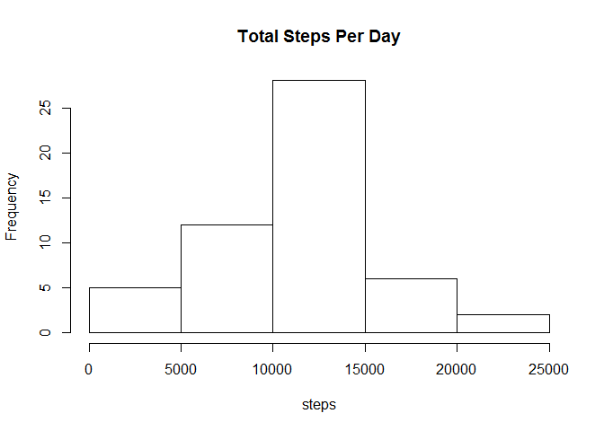
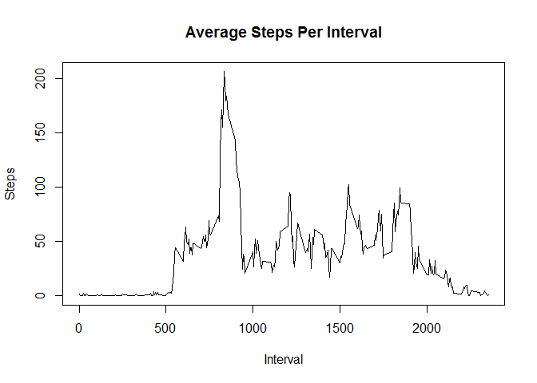
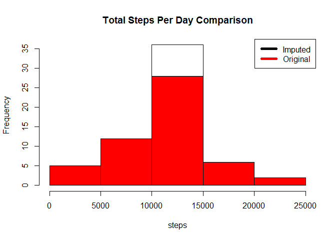
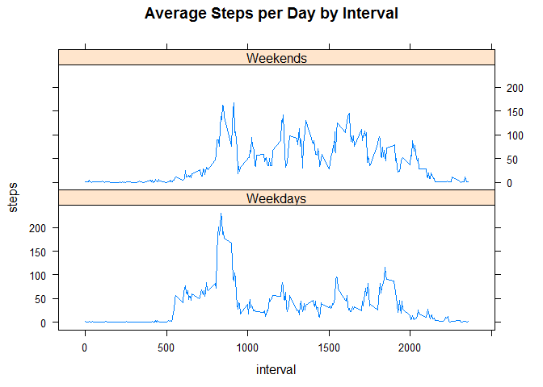

# Reproducible Research: Peer Assessment 1

## Loading and preprocessing the data

```r
data<-read.table(unz("./activity.zip","activity.csv"), header= TRUE, sep =",",colClasses= c("numeric","Date","numeric"))
```

## What is mean total number of steps taken per day?
1. Make a histogram of the total number of steps taken each day

```r
steps_per_day<- aggregate(steps ~ date, data, sum)
hist(steps_per_day$steps,main="Total Steps Per Day",xlab="steps")
```

 

2. Calculate and report the mean and median total number of steps taken
per day

```r
total_mean<-mean(steps_per_day$steps)
total_median<-median(steps_per_day$steps)
```
Total mean and median of number of steps taken per day is 1.0766189\times 10^{4} and 1.0765\times 10^{4}.

## What is the average daily activity pattern?
1. Make a time series plot (i.e. type = "l") of the 5-minute interval (x-axis)
and the average number of steps taken, averaged across all days (y-axis)

```r
avg_steps_per_interval<- aggregate(steps ~ interval, data, mean)
plot(as.numeric(avg_steps_per_interval$interval),avg_steps_per_interval$steps,main="Average Steps Per Interval",xlab="Interval", ylab="Steps",type ="l")
```

 

2. Which 5-minute interval, on average across all the days in the dataset,
contains the maximum number of steps?

```r
result<-avg_steps_per_interval[avg_steps_per_interval$steps ==max(avg_steps_per_interval$steps),1]
```
Interval 835 contains the maximum number of steps.

## Imputing missing values
1. Calculate and report the total number of missing values in the dataset
(i.e. the total number of rows with NAs)

```r
result<-sum(!complete.cases(data))
```
Total number of missing values in the dataset is 2304

2. Devise a strategy for filling in all of the missing values in the dataset. 
In this case, use mean for that 5-minute interval for filling in the missing steps.

3. Create a new dataset that is equal to the original dataset but with the
missing data filled in.

```r
newdata <- transform(data, steps = ifelse(is.na(data$steps), avg_steps_per_interval$steps[match(data$interval, avg_steps_per_interval$interval)], data$steps))
```

4. Make a histogram of the total number of steps taken each day and Calculate
and report the mean and median total number of steps taken per day. Do
these values differ from the estimates from the first part of the assignment?
What is the impact of imputing missing data on the estimates of the total
daily number of steps?


```r
steps_per_day1<- aggregate(steps ~ date, newdata, sum)
hist(steps_per_day1$steps,main="Total Steps Per Day Comparison",xlab="steps")
hist(steps_per_day$steps,add=T,col="red")
legend("topright", c("Imputed", "Original"), col=c("black", "red"), lwd=5)
```

 


```r
total_mean1<-mean(steps_per_day1$steps)
total_median1<-median(steps_per_day1$steps)
```
Imputed total mean and median of number of steps taken per day is 1.0766189\times 10^{4} and 1.0766189\times 10^{4}.

Original total mean and median of number of steps taken per day is 1.0766189\times 10^{4} and 1.0765\times 10^{4}.

Differences of mean amd median between imputed and original dataset is 0 and 
1.1886792

## Are there differences in activity patterns between weekdays and weekends?
1. Create a new factor variable in the dataset with two levels - "weekday"
and "weekend" indicating whether a given date is a weekday or weekend
day.
2. Make a panel plot containing a time series plot (i.e. type = "l") of the
5-minute interval (x-axis) and the average number of steps taken, averaged
across all weekday days or weekend days (y-axis). The plot should look
something like the following, which was creating using simulated data:

```r
weekends <- c("Sunday","Saturday")
newdata[,4]<-"Weekdays"
newdata[weekdays(newdata$date) %in% weekends,4]<-"Weekends"
steps_per_interval_b<- aggregate(steps ~ interval + V4, newdata, mean)

library(lattice)
newdata<-transform(newdata,V4=factor(V4))
xyplot(steps~interval|V4, data=steps_per_interval_b,layout =c(1,2),type="l",main="Average Steps per Day by Interval")
```

 

